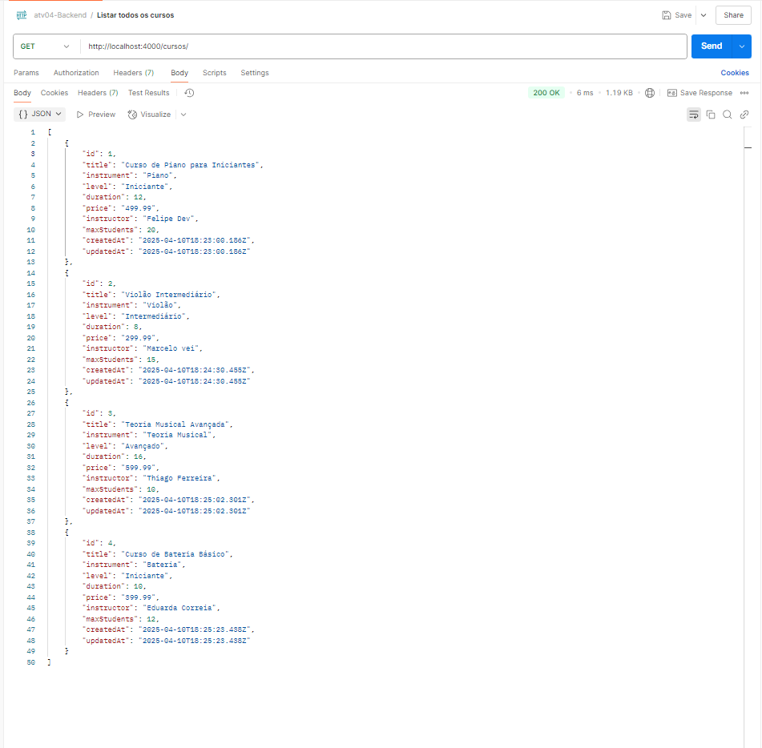
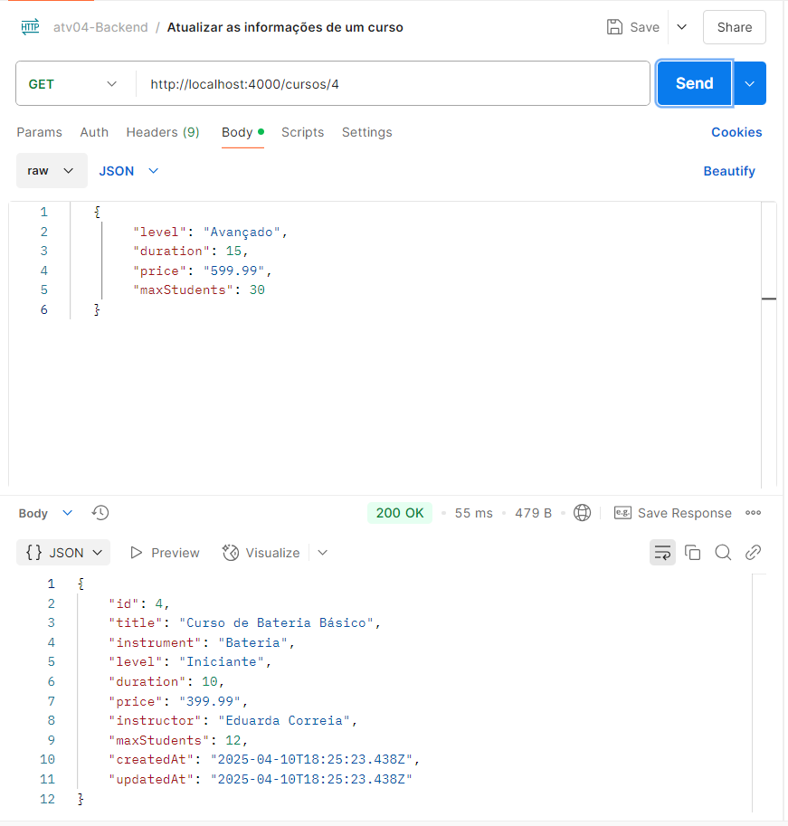
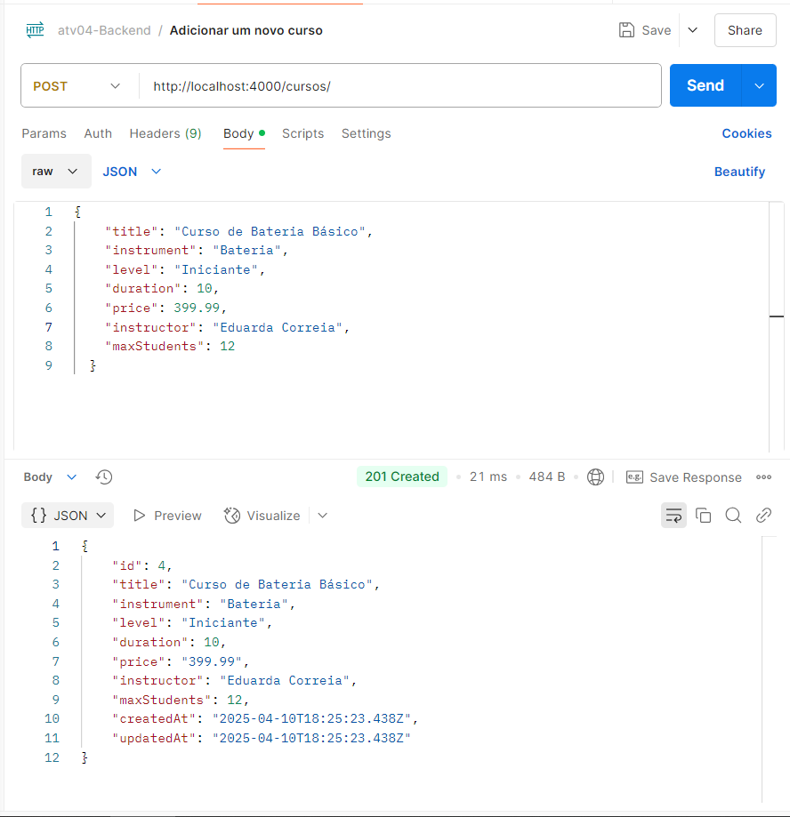
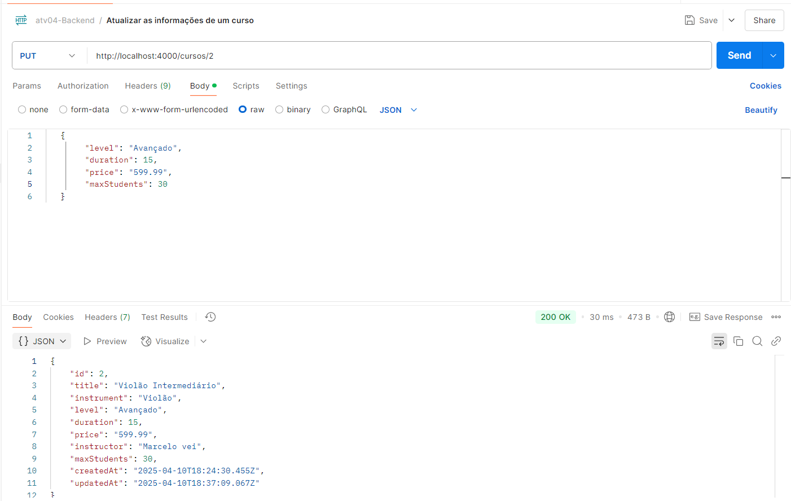
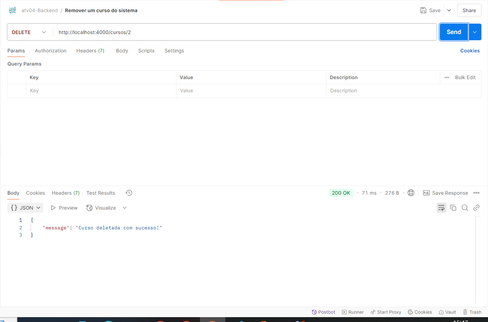

# Projeto Backend com Prisma - Sistema de Gerenciamento de Cursos Musicais

## Descrição do Projeto

Este projeto é uma API RESTful desenvolvida em Node.js para o gerenciamento de cursos. Utiliza o Prisma ORM para integração com o banco de dados SQLite, permitindo operações como criação, leitura, atualização e exclusão de cursos.

## Habilidades Trabalhadas

- Desenvolvimento de APIs RESTful com Node.js.
- Integração de ORM (Prisma) com projetos backend.
- Modelagem de dados e persistência.
- Tratamento de erros em aplicações assíncronas.
- Refatoração de código para padrões modernos.

## Tecnologias Utilizadas

- **Node.js**
- **Express.js**
- **Prisma ORM**
- **SQLite**

## Passo a Passo da Configuração

### 1. Instalando o Prisma

Primeiro, instale os pacotes necessários e inicialize o Prisma:

```bash
npm install prisma @prisma/client
npx prisma init
```

### 2. Configurando o arquivo .env

Crie ou modifique o arquivo `.env` na raiz do projeto:

```
DATABASE_URL="file:./dev.db"
```

Este é o caminho para o banco SQLite que será usado no desenvolvimento.

O Prisma já criou o arquivo `prisma/schema.prisma`. Modifique-o conforme o modelo final

## Passo a Passo da Configuração

### 1. Instalando o Prisma

Instale os pacotes necessários e inicialize o Prisma:

```bash
npm install prisma @prisma/client
npx prisma init
```

### 2. Configurando o arquivo `.env`

Crie ou modifique o arquivo `.env` na raiz do projeto com o seguinte conteúdo:

```
DATABASE_URL="file:./dev.db"
```

Este é o caminho para o banco SQLite que será usado no desenvolvimento.

### 3. Criando o arquivo `schema.prisma`

O Prisma já criou o arquivo `prisma/schema.prisma`. Modifique-o para refletir o modelo de cursos:

```prisma
generator client {
  provider = "prisma-client-js"
}

datasource db {
  provider = "sqlite"
  url      = env("DATABASE_URL")
}

model Cursos {
  id          Int      @id @default(autoincrement())
  title       String
  instrument  String
  level       String
  duration    Int
  price       Decimal
  instructor  String
  maxStudents Int
  createdAt   DateTime @default(now())
  updatedAt   DateTime @updatedAt

  @@map("Cursos")
}
```

### 4. Criando o cliente Prisma

Crie o arquivo `prisma/client.js`:


```javascript
import { PrismaClient } from "@prisma/client";

const prisma = new PrismaClient();

export default prisma;
```

### 5. Executando a migração inicial

Execute o comando para criar a migração e aplicá-la ao banco de dados:

```bash
npx prisma migrate dev --name init
```

---

## Estrutura do Projeto

### Modelos

Os modelos estão localizados em `src/models`. O arquivo `cursoModel.js` contém as operações de banco de dados para os cursos, como:

- `getAll`: Busca todos os cursos.
- `getById`: Busca um curso específico pelo ID.
- `create`: Cria um novo curso.
- `update`: Atualiza um curso existente.
- `delete`: Deleta um curso pelo ID.

### Controladores

Os controladores estão localizados em `src/controllers`. O arquivo `cursoController.js` contém a lógica para lidar com as requisições HTTP, como:

- `getAll`: Retorna todos os cursos.
- `getById`: Retorna um curso específico pelo ID.
- `create`: Cria um novo curso.
- `update`: Atualiza um curso existente.
- `delete`: Deleta um curso pelo ID.


### Rotas

As rotas estão configuradas para lidar com as operações de cursos. Exemplo de rotas:

- `GET /cursos`: Retorna todos os cursos.
- `GET /cursos/:id`: Retorna um curso específico pelo ID.
- `POST /cursos`: Cria um novo curso.
- `PUT /cursos/:id`: Atualiza um curso existente.
- `DELETE /cursos/:id`: Deleta um curso pelo ID.

---
## Demonstração das rotas funcionando
- `getAll`: Busca todos os cursos.


- `getById`: Busca um curso específico pelo ID.


- `create`: Cria um novo curso.


- `update`: Atualiza um curso existente.


- `delete`: Deleta um curso pelo ID.


---

## Passos Após Clonar o Repositório
1. Instale as dependências do projeto:

```bash
npm install
```

2. Configure o arquivo `.env` com a variável `DATABASE_URL` apontando para o banco de dados desejado:

```
DATABASE_URL="file:./dev.db"
```

3. Execute as migrações para criar o banco de dados:

```bash
npx prisma migrate dev
```

4. Inicie o servidor:

```bash
npm run dev
```

---

## Exemplos de Dados

Aqui estão exemplos de cursos que podem ser criados:

```json
[
    {
        "id": 1,
        "title": "Curso de Piano para Iniciantes",
        "instrument": "Piano",
        "level": "Iniciante",
        "duration": 12,
        "price": "499.99",
        "instructor": "Felipe Dev",
        "maxStudents": 20,
        "createdAt": "2025-04-10T18:23:00.186Z",
        "updatedAt": "2025-04-10T18:23:00.186Z"
    },
    {
        "id": 2,
        "title": "Teoria Musical Avançada",
        "instrument": "Teoria Musical",
        "level": "Avançado",
        "duration": 16,
        "price": "599.99",
        "instructor": "Thiago Ferreira",
        "maxStudents": 10,
        "createdAt": "2025-04-10T18:25:02.301Z",
        "updatedAt": "2025-04-10T18:25:02.301Z"
    },
    {
        "id": 3,
        "title": "Curso de Bateria Básico",
        "instrument": "Bateria",
        "level": "Iniciante",
        "duration": 10,
        "price": "399.99",
        "instructor": "Eduarda Correia",
        "maxStudents": 12,
        "createdAt": "2025-04-10T18:25:23.438Z",
        "updatedAt": "2025-04-10T18:25:23.438Z"
    }
]